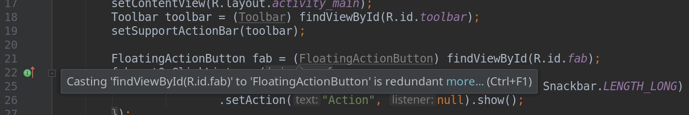

Research Week: The Idea
=======================

Working in IT, you see a lot of interesting topics which you like to take a closer look at.
New projects and technologies are developed every day.
Old technologies have evolved over time.

As a student I always liked to play with these technologies.
Now, with my full time job it's actually not that easy anymore.
I'll try to keep myself updated but unfortunately
I cannot just spend a day ignoring my job,
playing with some new and fancy project.
The problem of time…

That's why I decided to take a week off and dedicate this time to just that:
Trying new stuff, looking on how things have evolved over the last years
and finally, reporting my findings on this project blog.

Let's get started.

Schedule
--------

- [Day 1: Android Development: Updating From 2.3
  ](#android-development-updating-from-23)
- [Day 2-3: Kubernetes: Automatic Deployment at Scale.
  ](#kubernetes-automatic-deployment-at-scale)
- Day X: AWS, DigitalOcean and Azure: Looking at the Clouds
- Day X: Prometheus, Influx, Grafana & Co: Modern Monitoring
- Day X: Micro Project with Micro-Controller: Playing with the EMP32
- Day X: Server Update: New Server Infrastructure.
- Day X: To be dertermined. [Any suggestion? Let me know!
  ](https://twitter.com/intent/tweet?text=@larskiesow,%20look%20at%20this%20as%20part%20of%20your&hashtags=researchweek)

Android Development: Updating From 2.3
======================================

*Research topic for October 29, 2018*

The last time I developed a smartphone app was [back in 2014](https://github.com/lkiesow/andCA)
with a project developed for Android version 2.3
…some old folks might still remember that ;-)

A lot has happened since then in mobile app development and I like to catch up.
Hence, my first target for this day is to get an overview over recent
development techniques.

My second target is a bit more specific. That is to fix a bug in
[Simple-Calendar](https://github.com/SimpleMobileTools/Simple-Calendar) and
[FreeOTP+](https://github.com/helloworld1/FreeOTPPlus) each.
Let's see how far my newfound knowledge can get me.

Reporting Back
--------------

The first day is over and all-in-all, I declare it a success.
It could certainly have gotten smoother,
especially considering a stupid and completely unnecessary fight with udev,
but I wrote a demo App for my Android phone
and fixed an annoying bug in Simple Calendar.

### Android Studio, SDK and Tools

The first thing you want to do when starting with Android development is to get the SDK and probably also the Android Studio IDE.
While I really like a proper system integration of tools in Linux, unfortunately there really is none
and I ended up going the ugly but simple and effective way of just [downloading the Android Studio as a zip file](https://developer.android.com/studio/).
That will quickly give you a working development environment while also packing some stuff into your home folder
…and not even as hidden files. But maybe, you can configure that somewhere.

Starting the Android Studio and creating a new test project, I was greeted by the (to me) familiar sight of Intellij IDEA
since Google dropped the old Eclipse based Android Studio I had been using before. I don't mind.
What I thought was a bit funny was that IDEA was already recommending changes in the newly created project.
Maybe Google should update their templates:

In any case, I was ready for development.

### Connecting Devices

While I could have used the Android emulator for testing,
I wanted to connect my smartphone instead.
I though this would come handy in particular when I started working on some bug-fixes for Apps I use
since there I would have real data.

This needed a bit of configuration.
First, I had to choose between the android-tools packaged in Fedora and the ones I got along with the Android Studio and SDK.
I opted for the latter since they are newer and I now had them anyway.
I also needed to set-up some udev rules to properly set permissions.
Doing that, a stupid typo in the rules file name cost me around an hour. Avoid that.
For the whole process, I found a surprisingly good and short guide in the [Fedora Forums](https://forums.fedoraforum.org/showthread.php?298965)
which helped me to get to where I wanted.

Additionally to this, I had to configure my device.
This was a matter of tapping the Build Number entry in the phone's settings seven times,
after which I was declared a developer and the Developer settings appeared in which I could enable USB debugging.

</img>

### The First App (Again)

Playing a little bit with my test App and slightly extending it  by adding a new dialog,
I found that things still worked essentially the same as four years ago
and 20min later I had my new App running on my device:

<video controls muted src="day1-first-app.mp4" width="200"></video>

I've also played a bit with my old [andCA](https://github.com/lkiesow/andCA) App which I was still able to install and launch.
I wouldn't say that it's still running though.
It looked really ugly and parts where crashing.

### Fixing Simple-Calendar

Due to my struggle with udev, I had lost some time and I decided to go only for one final App fix
which I decided should be [Simple-Calendar](https://github.com/SimpleMobileTools/Simple-Calendar).
It's an App I really like but which has a flaw in its iCalendar generation for CalDAV clients
which causes it to generate invalid single day, all-day events.

Poking around in its Kodlin source code, a language I hadn't worked with before (yay, more new stuff!),
I finally managed to locate the problem and was able to produce a [very simple bug fix](https://github.com/SimpleMobileTools/Simple-Calendar/pull/684)
for the problem.

*That concludes day 1.*

Kubernetes: Automatic Deployment at Scale
=========================================

*Research topic for October 30, 2018*

Today, Kubernetes is the de-facto standard when it comes to container orchestration and deployment.
I've read about it, talked to people about it, I know what it is doing but…
I've never actually used it.
That's to be changed today!

Getting Started
---------------

Looking around for resources, I ended up with the interactive
[Kubernetes Basics Tutorial](https://kubernetes.io/docs/tutorials/kubernetes-basics/)
of [kubernetes.io](https://kubernetes.io).
Usually, I dislike long tutorials because I'm more a hands-on person
but this tutorial does let you play with a real Kubernetes environment
where you can ignore the instructions at any time to shortly try something else.

I also found the online shell (including auto-completion) used for the tutorial a pleasant surprise.
In short: I really recommend this tutorial to get started.

### Non-Scaling Kubernetes

Looking at Kubernetes, one of the first things you learn is that Kubernetes is really meant for larger systems, not for your one server at home:

> A Kubernetes cluster that handles production traffic should have a minimum of three nodes.

In a way, this makes sense because that will give you a failover e.g. if a node goes down or you have to run maintenance on it.
It's also not that hard if you run in an agile, server-less environment by e.g. relying on one of the big cloud providers.
Nevertheless, that does makes it hard to use in a small scale on your home server.

Sure, there are a few solutions like kubeadm for [creating a single master cluster](https://kubernetes.io/docs/setup/independent/create-cluster-kubeadm/)
but options like these do not seem to be [stable](https://kubernetes.io/docs/setup/independent/create-cluster-kubeadm/#kubeadm-maturity) right now
and in most cases (e.g. [minikube](https://kubernetes.io/docs/setup/minikube/)) are actually only meant for testing.

For my upcoming server update, I'll hence likely not rely on Kubernetes.
Nevertheless I will still use containers.
I will also continue to look into this since even if you loose some of the high-availability features,
a small scale Kubernetes will still provide you with a homogeneous deployment option for all types of setups.

### Kubernetes @Work

Looking at what I am usually doing at work and assessing the possibilities Kubernetes would provide,
I think we would benefit quite a bit from using it.
The main problem would likely be to convince University data-centers I usually work with
to run a Kubernetes cluster.
Weird as it may sound, I found them having a tendency to be extremely conservative
and reluctant to introduce new technologies
despite them being research institutions.

Right now we are managing quite a number of virtual machines to run applications.
A lot of these are really small applications (e.g. consider [docs.opencast.org](https://docs.opencast.org)
which is barely more than a web-server with static content)
and it really does not matter where they run.
But right now, you always have to make a concious decision to either provision a new virtual machine for such a service
or to bundle it with another service on a single machine.

Not having to care about this would be great and would remove quite a bit of daily work while making hardware provisioning, etc. much easier.
After all, we can easily replace a whole Node
and Kubernetes will take care of the services running somewhere.

### More Kubernetes

Screw the schedule 😼
I've decided to look into this a bit further.
Certainly as part of the cloud provider test,
but I will also try another local deployment.
